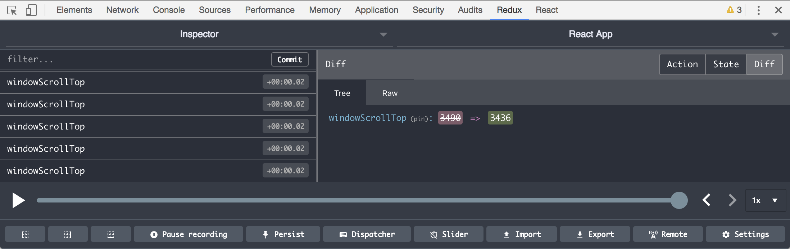
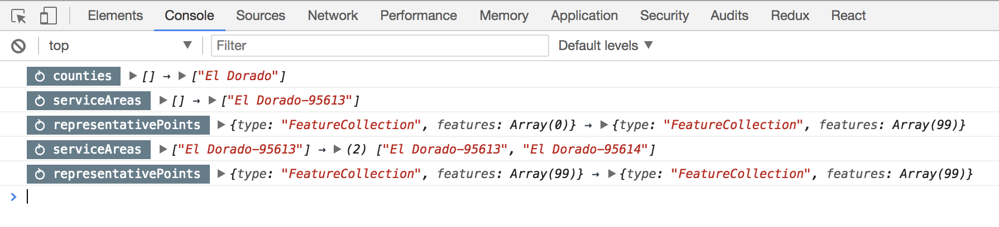

[![Build Status][build]](https://circleci.com/gh/bcherny/undux) [![npm]](https://www.npmjs.com/package/undux) [![mit]](https://opensource.org/licenses/MIT) [![ts]](https://www.typescriptlang.org/) [![flow]](https://flow.org/)

[build]: https://img.shields.io/circleci/project/github/bcherny/undux/master.svg?style=flat-square
[npm]: https://img.shields.io/npm/v/undux.svg?style=flat-square
[mit]: https://img.shields.io/npm/l/undux.svg?style=flat-square
[ts]: https://img.shields.io/badge/TypeScript-%E2%9C%93-007ACC.svg?style=flat-square
[flow]: https://img.shields.io/badge/Flow-%E2%9C%93-007ACC.svg?style=flat-square

> Dead simple state management for React

------
## 📖 Official docs: https://undux.org
------

## Install (with RxJS v5 or v6 - recommended)

```sh
# Using Yarn:
yarn add undux

# Or, using NPM:
npm install undux --save
```

## Install (with RxJS v4)

```sh
# Using Yarn:
yarn add undux@^3

# Or, using NPM:
npm install undux@^3 --save
```

## Design Goals

1. Complete type-safety, no exceptions
2. Super easy to use: forget actions, reducers, dispatchers, containers, etc.
3. Familiar abstractions: just `get` and `set`

[Read more here](https://github.com/bcherny/undux#design-philosophy)

## Use

### 1. Create a store

```jsx
import { createConnectedStore } from 'undux'

// Create a store with an initial value.
export default createConnectedStore({
  one: 0,
  two: 0
})
```

*Be sure to define a key for each value in your model, even if the value is initially `undefined`.*

### 2. Connect your React components

#### With [React Hooks](https://reactjs.org/docs/hooks-intro.html):

```jsx
import Store from './MyStore'

// Re-render the component when the store updates.
function MyComponent() {
  let store = Store.useStore()
  return <div>
    <NumberInput onChange={store.set('one')} value={store.get('one')} />
    <NumberInput onChange={store.set('two')} value={store.get('two')} />
    Sum: {store.get('one') + store.get('two')}
  </div>
}

function NumberInput() {
  return <input
    onChange={e => this.props.onChange(parseInt(e.target.value, 10))}
    type="number"
    value={this.props.value}
  />
}

export default MyComponent
```

#### Without React Hooks:

```jsx
import Store from './MyStore'

// Re-render the component when the store updates.
class MyComponent extends React.Component {
  render() {
    let store = this.props.store
    return <div>
      <NumberInput onChange={store.set('one')} value={store.get('one')} />
      <NumberInput onChange={store.set('two')} value={store.get('two')} />
      Sum: {store.get('one') + store.get('two')}
    </div>
  }
}

class NumberInput extends React.Component {
  render() {
    return <input
      onChange={e => this.props.onChange(parseInt(e.target.value, 10))}
      type="number"
      value={this.props.value}
    />
  }
}

export default Store.withStore(MyComponent)
```

### 3. Put your app in an Undux Container

```jsx
import MyComponent from './MyComponent'
import Store from './MyStore'

class MyApp extends React.Component {
  render() {
    return <Store.Container>
      <MyComponent />
    </Store.Container>
  }
}

export default MyApp
```

**That's all there is to it.**

[Open this code in playground](https://stackblitz.com/edit/undux-readme-demo-js).

## Features

### Effects

Though Undux automatically re-renders your connected React components for you when the store updates, it also lets you subscribe to changes to specific fields on your store. Undux subscriptions are full [Rx observables](http://reactivex.io/rxjs/class/es6/Observable.js~Observable.html), so you have fine control over how you react to a change:

```ts
import { debounce, filter } from 'rxjs/operators'

store
  .on('today')
  .pipe(
    filter(date => date.getTime() % 2 === 0), // Only even timestamps.
    debounce(100) // Fire at most once every 100ms.
  )
  .subscribe(date =>
    console.log('Date changed to', date)
  )
```

You can even use Effects to trigger a change in response to an update:

```ts
store
  .on('today')
  .pipe(
    debounce(100)
  )
  .subscribe(async date => {
    let users = await api.get({ since: date })
    store.set('users')(users)
  })
```

In order to keep its footprint small, Undux does not come with RxJS out of the box. However, Undux does come with a minimal implementation of parts of RxJS, which interoperates with RxJS operators. To use RxJS operators, you'll need to install RxJS first:

```sh
npm install rxjs --save
```

### Partial application

Partially apply the `set` function to yield a convenient setter:

```tsx
let setUsers = store.set('users')
setUsers(['amy'])
setUsers(['amy', 'bob'])
```

### Built-in logger

Undux works out of the box with the Redux Devtools browser extension (download: [Chrome](https://chrome.google.com/webstore/detail/redux-devtools/lmhkpmbekcpmknklioeibfkpmmfibljd), [Firefox](https://addons.mozilla.org/firefox/addon/remotedev/), [React Native](https://github.com/zalmoxisus/remote-redux-devtools)). To enable it, just wrap your store with the Redux Devtools plugin:

```ts
import { createConnectedStore, withReduxDevtools } from 'undux'

let store = createConnectedStore(initialState, withReduxDevtools)
```

Redux Devtools has an inspector, a time travel debugger, and jump-to-state built in. All of these features are enabled for Undux as well. It looks like this:



Alternatively, Undux has a simple, console-based debugger built in. Just create your store with `withLogger` higher order store, and all model updates (which key was updated, previous value, and new value) will be logged to the console.

To enable the logger, simply import `withLogger` and wrap your store with it:

```ts
import { createConnectedStore, withLogger } from 'undux'

let store = createConnectedStore(initialState, withLogger)
```

The logger will produce logs that look like this:



### Effects

Undux is easy to modify with effects. Just define a function that takes a store as an argument, adding listeners along the way. For generic plugins that work across different stores, use the `.onAll` method to listen on all changes on a store:

```ts
// MyStore.ts (if using TypeScript)
import { Effects } from 'undux'

type State = {
  // ...
}

export type StoreEffects = Effects<State>

// MyEffects.ts
import { StoreEffects } from './MyStore'

let withLocalStorage: StoreEffects = store => {

  // Listen on all changes to the store.
  store.onAll().subscribe(({ key, value, previousValue }) =>
    console.log(key, 'changed from', previousValue, 'to', value)
  )

}
```

## Recipes

### Creating a store (TypeScript)

```ts
import { createConnectedStore, Effects, Store } from 'undux'

type State = {
  foo: number
  bar: string[]
}

let initialState: State = {
  foo: 12,
  bar: []
}

export default createConnectedStore(initialState)

export type StoreProps = {
  store: Store<State>
}

export type StoreEffects = Effects<State>
```

[See full example (in JavaScript, TypeScript, or Flow) here](https://undux.org/#examples/basic-usage).

### Stateless component with props (TypeScript)

Have your own props? No problem.

```ts
import MyStore, { StoreProps } from './MyStore'

type Props = StoreProps & {
  foo: number
}

function MyComponent(props: Props) {
  return <>
    Today is {props.store.get('today')}
    Foo is {props.foo}
  </>
}

export default MyStore.withStore(MyComponent)

// Usage
<MyComponent foo={3} />
```

[See full example (in JavaScript, TypeScript, or Flow) here](https://undux.org/#examples/stateless-component-with-props).

### Stateful component with props (TypeScript)

Undux is as easy to use with stateful components as with stateless ones.

```tsx
import MyStore, { StoreProps } from './MyStore'

type Props = StoreProps & {
  foo: number
}

class MyComponent extends React.Component<Props> {
  render() {
    return <>
      Today is {this.props.store.get('today')}
      Foo is {this.props.foo}
    </>
  }
}

export default MyStore.withStore(MyComponent)

// Usage
<MyComponent foo={3} />
```

[See full example (in JavaScript, TypeScript, or Flow) here](https://undux.org/#examples/class-component-with-props).

### Undux + Hot module reloading

See a full example [here](https://github.com/bcherny/undux-hot-module-reloading-demo).

### Undux + TodoMVC

See the Undux TodoMVC example [here](https://github.com/bcherny/undux-todomvc).

## Design philosophy

**Goal #1 is total type-safety.**

Getting, setting, reading, and listening on model updates is 100% type-safe: use a key that isn't defined in your model or set a key to the wrong type, and you'll get a compile-time error. And connected components and Effects are just as type-safe.

**Goal #2 is letting you write as little boilerplate as possible.**

Define your model in a single place, and use it anywhere safely. No need to define tedious boilerplate for each field on your model. Container components and action creators are optional - most of the time you don't need them, and can introduce them only where needed as your application grows.

**Goal #3 is familiar abstractions.**

No need to learn about Actions, Reducers, or any of that. Just call `get` and `set`, and everything works just as you expect.

## Tests

```sh
yarn test
```

## License

MIT
